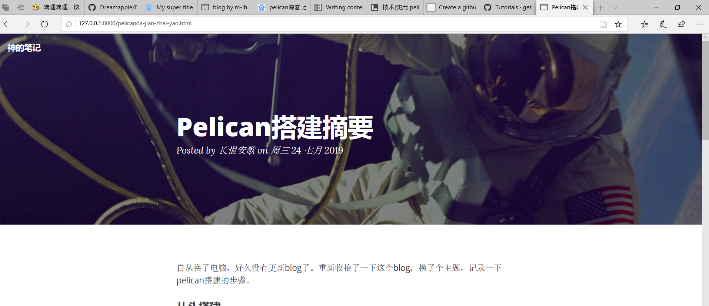

自从换了电脑，好久没有更新blog了。重新收拾了一下这个blog，换了个主题，记录一下pelican搭建的步骤。

### 从头搭建

```shell
pip install pelican  # 首先是主角pelican
pip install markdown # 如果不安装markdown，是无法识别md文件的。
pip install invoke   # 安装invoke就可以使用invoke自动管理文件了。
pip install ghp-import # ghp-import是专门提交文档分支的工具。

# 申请ghpage，然后clone到本地
git clone https://github.com/m-lh/m-lh.github.io.git
cd m-lh.github.io
pelican-quickstart
# 下面回答一系列问题
# 但是回答的问题可以在配置文件修改。主要是设置gh-page为y就行。
Welcome to pelican-quickstart v4.1.0.

This script will help you create a new Pelican-based website.

Please answer the following questions so this script can generate the files
needed by Pelican.

> Where do you want to create your new web site? [.]
> What will be the title of this web site? 神的笔记
> Who will be the author of this web site? 长恨安歌
> What will be the default language of this web site? [Chinese (Simplified)]
> Do you want to specify a URL prefix? e.g., https://example.com   (Y/n) n
> Do you want to enable article pagination? (Y/n)
> How many articles per page do you want? [10]
> What is your time zone? [Asia/Shanghai]
> Do you want to generate a tasks.py/Makefile to automate generation and publishing? (Y/n)
> Do you want to upload your website using FTP? (y/N) n
> Do you want to upload your website using SSH? (y/N) n
> Do you want to upload your website using Dropbox? (y/N) n
> Do you want to upload your website using S3? (y/N) n
> Do you want to upload your website using Rackspace Cloud Files? (y/N) n
> Do you want to upload your website using GitHub Pages? (y/N) y
> Is this your personal page (username.github.io)? (y/N) y
Done. Your new project is available at D:\blog\m-lh.github.io

# 下面拷贝写好的md文件到content目录
# old/blog是以前使用旧的jekyll的博客内容
cp ../old/blog/_posts content
# invoke模块实时查看，执行
inv livereload
inv gh-pages
```

### 切换主题
```
# 下载一个主题。主题从http://www.pelicanthemes.com网站选择
# https://github.com/getpelican/pelican-themes
git clone https://github.com/gilsondev/pelican-clean-blog.git
# 修改主题的配置
echo 'THEME = "./pelican-clean-blog"' >> pelicanconf.py
```
效果如下：


### 添加图片内容的配置
```shell
mkdir -p content/images
# 下面可以不用，默认images就是静态内容。
# echo 'STATIC_PATHS = ["images"]' >> pelicanconf.py  
```
之后输入内容时，使用下面的就可以插入图片了。
```markdown

```

### 提交原内容
```
# 添加.gitignore文件
cat > .gitignore
__pycache__/
output/
*.py[cod]
^D

# 将当前的目录提交到source分支。master用来作为主页。
git checkout -b source
git add .
git commit -c "init pelican"

git push --set-upstream origin source
git push
```
然后在github的设置中，将默认分支设置为source


以后就可以直接clone下来，修改内容，inv pg-pages了。